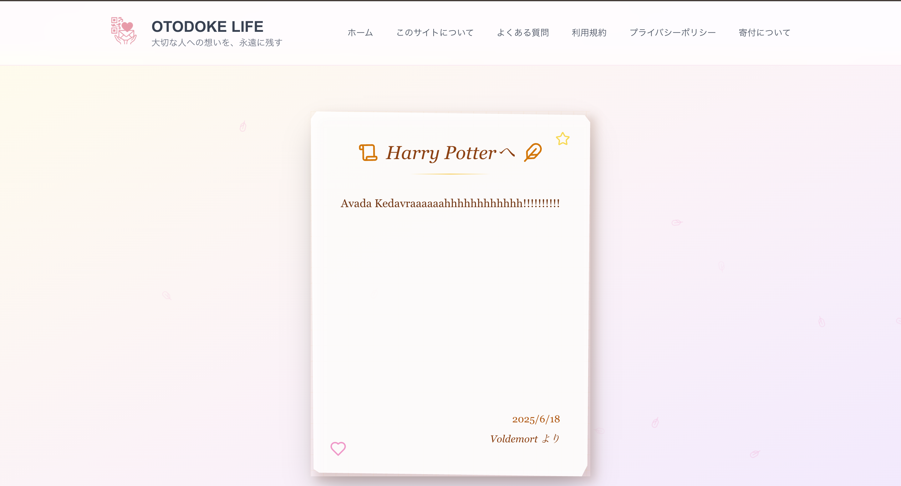

# OTODOKE LIFE - Message for the Future

## Overview
OtoDoke is a platform designed to help you preserve and share your heartfelt messages with loved ones. Whether it's for special occasions, daily gratitude, or future communications, our service provides a secure and elegant way to keep your thoughts and feelings alive.

## 🛠 Technology Stack

### Frontend
| Technology | Version | Selection Reason |
|------------|---------|-----------------|
| Next.js | 14.0.0 | Optimal for SEO with server-side rendering and static generation. Leverages the latest App Router features |
| React | 18.2.0 | Component-based development with efficient virtual DOM rendering. Large community and rich ecosystem |
| TypeScript | 5.3.0 | Enhanced development efficiency through type safety and early bug detection. Improved code readability and maintainability |
| Tailwind CSS | 3.4.0 | Rapid UI development with utility-first approach. High customizability and performance optimization |
| Framer Motion | 10.16.0 | Smooth animations and interactions. Excellent React integration with declarative animation syntax |
| GSAP | 3.12.0 | Advanced animation control and performance optimization. Ideal for complex animation sequences |

### Backend & Infrastructure
| Technology | Version | Selection Reason |
|------------|---------|-----------------|
| Node.js | 18.17.0 | Stable LTS version. High performance through asynchronous processing and event-driven architecture |
| Vercel | Latest | Excellent Next.js integration with global CDN. Automated deployments and scalability |


### Development Tools
| Technology | Version | Selection Reason |
|------------|---------|-----------------|
| ESLint | 8.56.0 | Maintains code quality and enforces consistent coding style |
| Prettier | 3.1.0 | Ensures consistent code formatting across the project |
| Jest | 29.7.0 | Unit and snapshot testing. Optimal for React component testing |
| GitHub Actions | - | Automated CI/CD pipeline. Maintains code quality and efficient deployment |

### Performance & Analytics
| Technology | Version | Selection Reason |
|------------|---------|-----------------|
| Google Analytics | 4 | User behavior analysis and performance measurement. Comprehensive free analytics tool |


### Key Technical Decisions
1. **Performance Focus**
   - Fast initial load times
   - Smooth animations
   - Optimized bundle size

2. **Development Efficiency**
   - Type safety for early bug detection
   - Rich developer tools
   - Active community support

3. **Scalability**
   - Serverless architecture
   - Global CDN
   - Auto-scaling capabilities

4. **Security**
   - Latest security practices
   - Regular updates
   - Robust authentication system

## Features

### Home Page (/)
- Intuitive message creation form
- QR code generation
- Service overview
- User-friendly interface for seamless experience


---

### Letter View Page (/letter)
- Access messages via QR code
- Animated message display
- Sender information and timestamp
- Elegant presentation




---

### Terms of Service (/terms)
- Comprehensive service terms
- Interactive table of contents
- Easy navigation between sections


---

### Privacy Policy (/privacy)
- Detailed privacy guidelines
- Data handling policies
- Contact information
- User rights and responsibilities


---

### FAQ Section (/faq)
- Categorized common questions
- Search functionality
- Comprehensive answers
- Regular updates


---

### Donation Page (/donate)
- Support options
- Donation methods
- Recognition for contributors
- Impact transparency


---

### About Page (/about)
- Developer introduction
- Service mission and vision
- Social media links
- Project background


---

## Technical Features
- Message creation and QR code generation
- Privacy policy and terms of service integration
- Comprehensive FAQ system
- Contact form functionality
- Responsive design
- Cross-browser compatibility

## Getting Started

### Prerequisites
- Node.js 18.0.0 or higher
- npm 9.0.0 or higher

### Installation
1. Clone the repository
   ```bash
   git clone https://github.com/meso1007/NEXT-QRcodeMessage-WebApp
   cd otodoke
   ```

2. Install dependencies
   ```bash
   npm install
   ```

3. Start the development server
   ```bash
   npm run dev
   ```

4. Open [http://localhost:3000](http://localhost:3000) in your browser

### Building for Production
```bash
npm run build
npm start
```

## Contributing
We welcome contributions! Please read our [Contributing Guidelines](CONTRIBUTING.md) for details on our code of conduct and the process for submitting pull requests.

## License
This project is licensed under the MIT License - see the [LICENSE](LICENSE) file for details.

## Acknowledgments
- Special thanks to all contributors and supporters
- Inspired by the need for meaningful digital communication
- Built with ❤️ for a better future

## Contact
- Email: diegoshoya2017@gmail.com
- Website: [http://99.79.63.2/](http://99.79.63.2/)
- GitHub: [@meso1007](https://github.com/meso1007)
