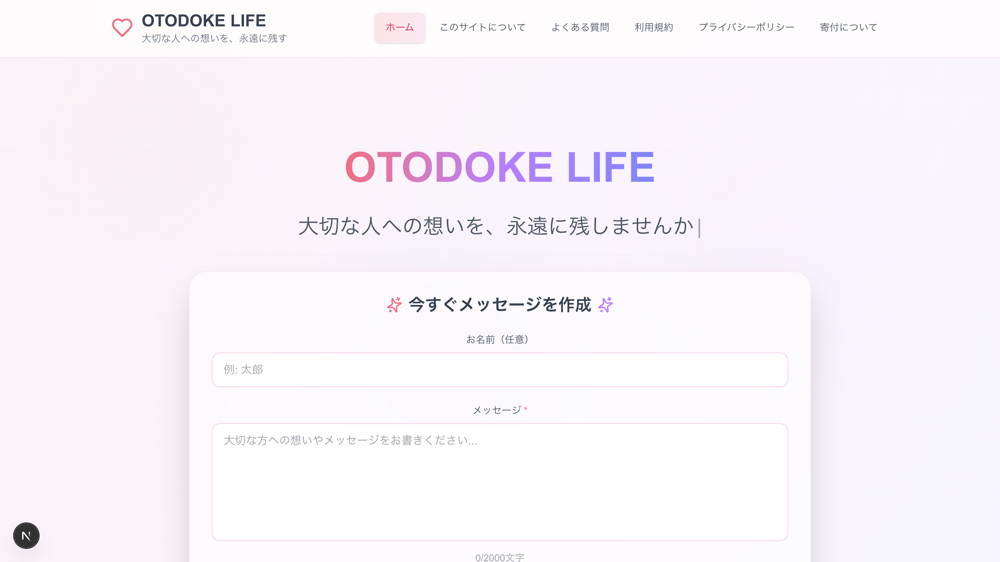
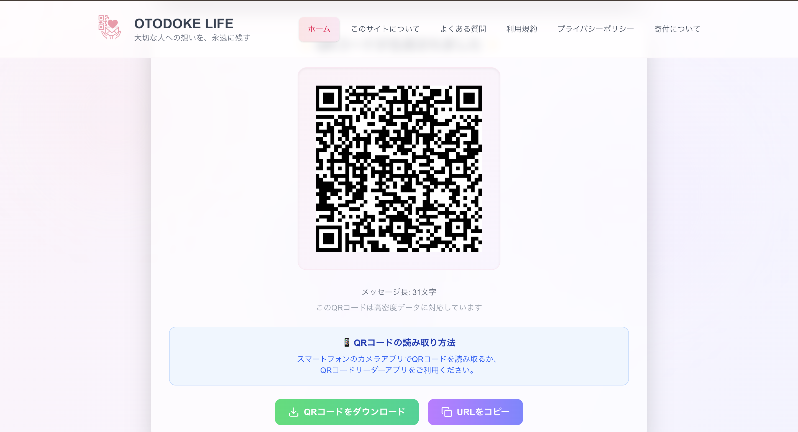
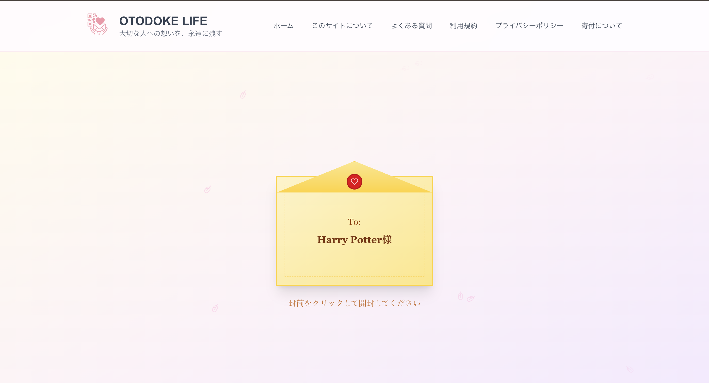
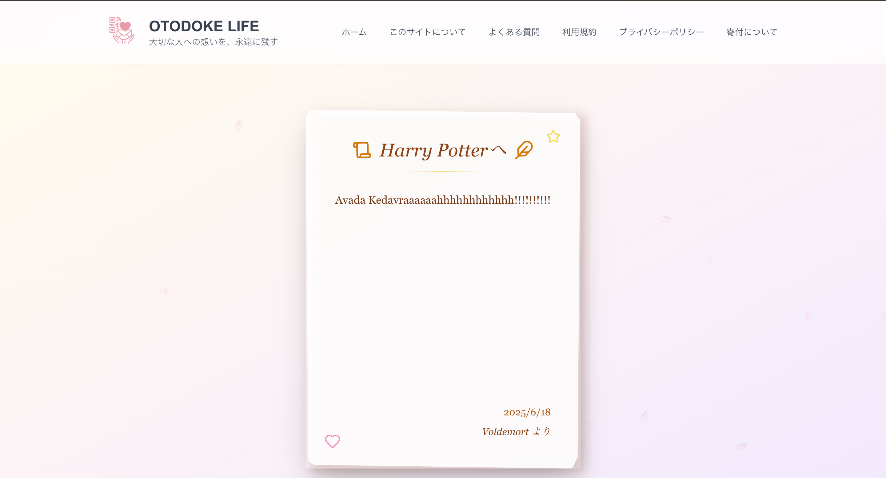
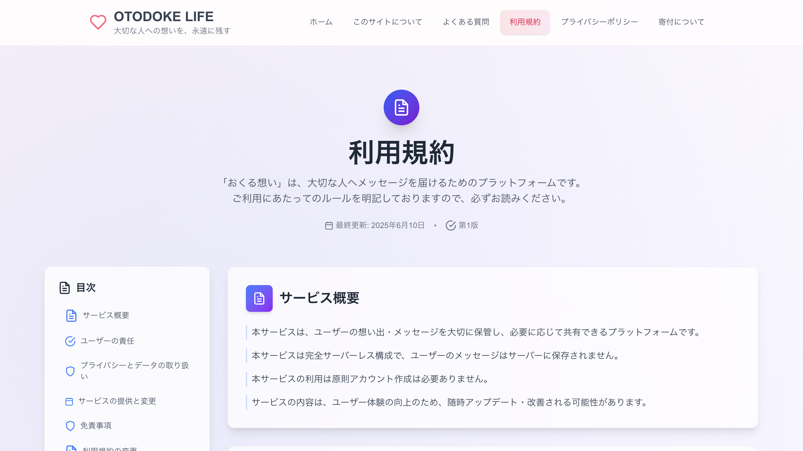
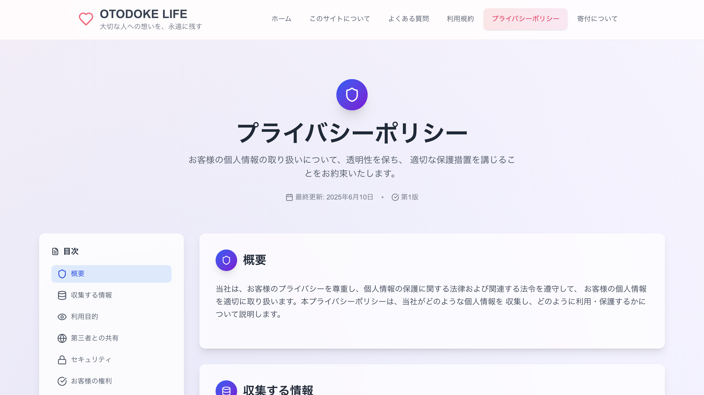
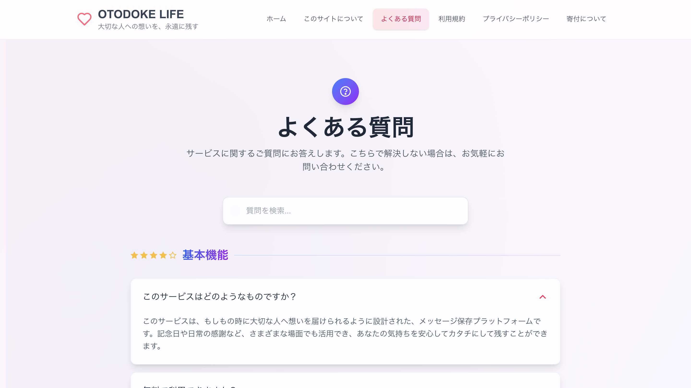
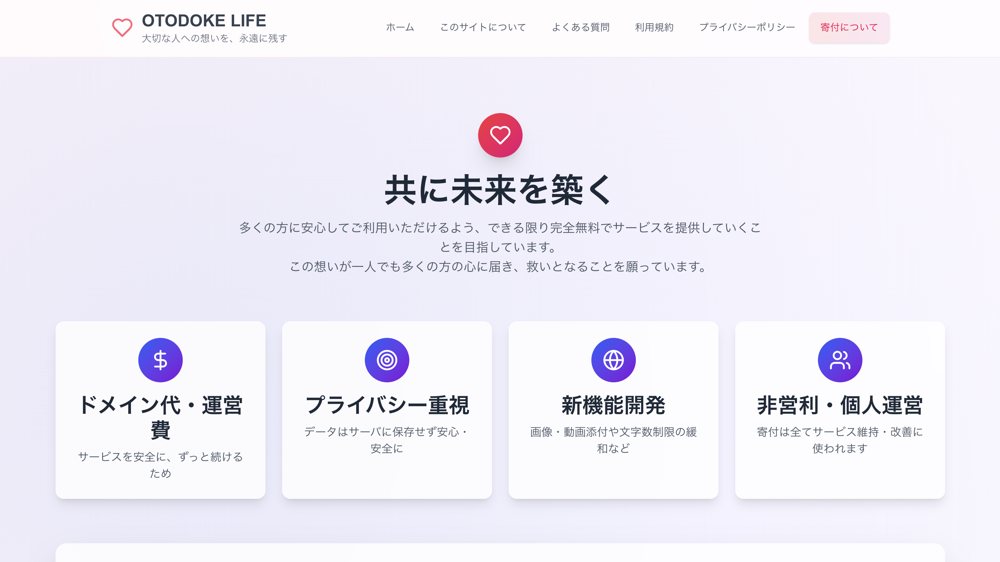
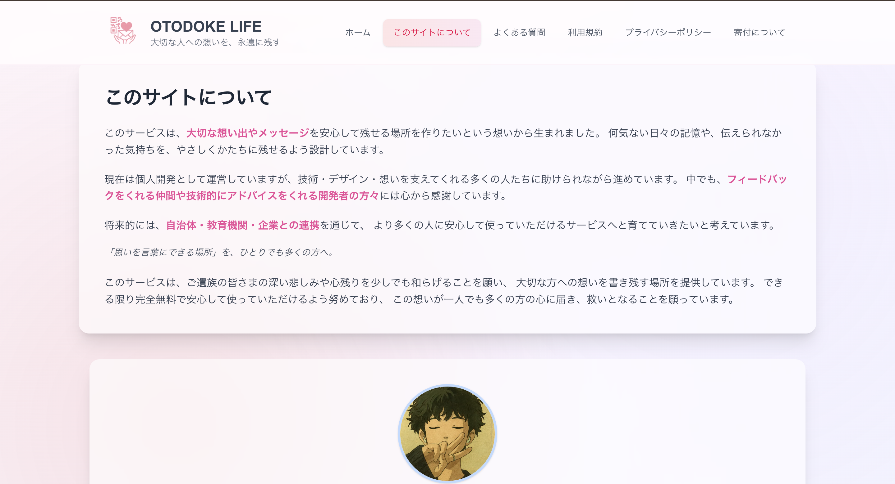

# OTODOKE LIFE

OTODOKE LIFE is a web application for creating heartfelt messages and sharing them through QR codes.  
It is designed for simple creation, elegant reading, and easy access on both desktop and mobile devices.

## Table of Contents
- [Overview](#overview)
- [Key Features](#key-features)
- [Screens](#screens)
- [Technology Stack](#technology-stack)
- [Contact](#contact)

## Overview

The app allows users to:
- Create and store a message.
- Generate a QR code linked to that message.
- Share the QR code so recipients can read the message from a dedicated letter view.

In addition to the core message flow, the project includes supporting pages such as Terms, Privacy Policy, FAQ, Donate, and About.

## Key Features

- **Message creation flow** with QR code generation.
- **Letter view experience** optimized for readability and presentation.
- **Informational pages** for Terms, Privacy Policy, FAQ, Donate, and About.
- **Responsive UI** built for modern browsers and mobile devices.
- **Type-safe codebase** using TypeScript and Next.js App Router.

## Screens

### Home (`/`)
- Message input and QR code generation
- Service introduction

### Letter (`/letter`)
- QR-based message access
- Animated reveal and sender metadata

### Terms (`/terms`)
- Terms of service with structured navigation

### Privacy (`/privacy`)
- Privacy policy and data handling guidance

### FAQ (`/faq`)
- Categorized Q&A with search

### Donate (`/donate`)
- Donation options and support information

### About (`/about`)
- Project and developer background

## Technology Stack

### Frontend
| Technology | Version |
|------------|---------|
| Next.js | 14.0.0 |
| React | 18.2.0 |
| TypeScript | 5.3.0 |
| Tailwind CSS | 3.4.0 |
| Framer Motion | 10.16.0 |
| GSAP | 3.12.0 |

### Runtime / Infrastructure
| Technology | Version |
|------------|---------|
| Bun | 1.3+ |
| Node.js | 18.17.0 |
| Vercel | Latest |

### Tooling / Quality
| Technology | Version |
|------------|---------|
| ESLint | 8.56.0 |
| Prettier | 3.1.0 |
| Jest | 29.7.0 |
| GitHub Actions | - |
| Google Analytics | 4 |

## Contact

- Email: [diegoshoya2017@gmail.com](mailto:diegoshoya2017@gmail.com)
- Website: [https://www.otodokelife.com/](https://www.otodokelife.com/)
- GitHub Repo: [https://github.com/meso1007/NEXT-QRcodeMessage-WebApp](https://github.com/meso1007/NEXT-QRcodeMessage-WebApp)
