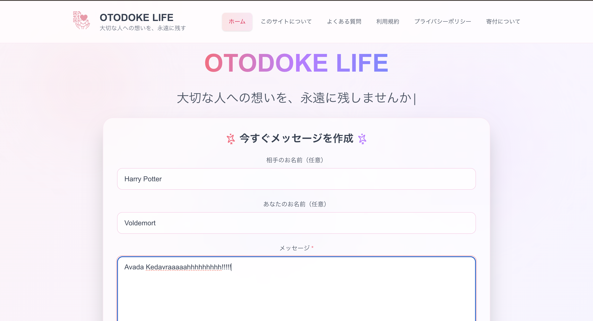

# OTODOKE LIFE - Message for the Future

## Overview
OtoDoke is a platform designed to help you preserve and share your heartfelt messages with loved ones. Whether it's for special occasions, daily gratitude, or future communications, our service provides a secure and elegant way to keep your thoughts and feelings alive.

## Features

### Home Page (/)
- Intuitive message creation form
- QR code generation
- Service overview
- User-friendly interface for seamless experience




---

### Letter View Page (/letter)
- Access messages via QR code
- Animated message display
- Sender information and timestamp
- Elegant presentation


---

### Terms of Service (/terms)
- Comprehensive service terms
- Interactive table of contents
- Easy navigation between sections


---

### Privacy Policy (/privacy)
- Detailed privacy guidelines
- Data handling policies
- Contact information
- User rights and responsibilities


---

### FAQ Section (/faq)
- Categorized common questions
- Search functionality
- Comprehensive answers
- Regular updates


---

### Donation Page (/donate)
- Support options
- Donation methods
- Recognition for contributors
- Impact transparency


---

### About Page (/about)
- Developer introduction
- Service mission and vision
- Social media links
- Project background


---

## Technical Features
- Message creation and QR code generation
- Privacy policy and terms of service integration
- Comprehensive FAQ system
- Contact form functionality
- Responsive design
- Cross-browser compatibility

## Tech Stack
- **Frontend**: React 18, Next.js 14, TypeScript
- **Styling**: Tailwind CSS
- **Animations**: GSAP, Framer Motion
- **Icons**: Lucide React
- **State Management**: React Hooks
- **Build Tool**: Vite

## Getting Started

### Prerequisites
- Node.js 18.0.0 or higher
- npm 9.0.0 or higher

### Installation
1. Clone the repository
   ```bash
   git clone https://github.com/yourusername/otodoke.git
   cd otodoke
   ```

2. Install dependencies
   ```bash
   npm install
   ```

3. Start the development server
   ```bash
   npm run dev
   ```

4. Open [http://localhost:3000](http://localhost:3000) in your browser

### Building for Production
```bash
npm run build
npm start
```

## Contributing
We welcome contributions! Please read our [Contributing Guidelines](CONTRIBUTING.md) for details on our code of conduct and the process for submitting pull requests.

## License
This project is licensed under the MIT License - see the [LICENSE](LICENSE) file for details.

## Acknowledgments
- Special thanks to all contributors and supporters
- Inspired by the need for meaningful digital communication
- Built with ❤️ for a better future

## Contact
- Email: otodokelife@gmail.com
- Website: [http://99.79.63.2/](http://99.79.63.2/)
- GitHub: [@meso1007](https://github.com/meso1007)
